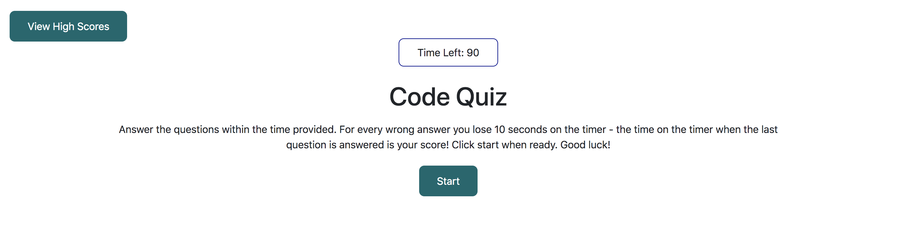
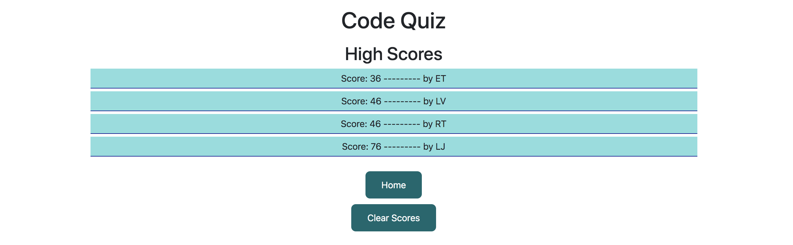

# code-quiz

A Javascript based quiz on coding concepts. The timer starts at 90 seconds, whatever time is left after the final question is answered is the score. 

Questions cover a range of topics, from Javascript to CSS to HTML : 

Once all questions are answered (or time runs out), users are prompted to enter their initials and a score is assigned based on the time left on the timer and their data is stored in local storage : 

Users are then taken to the High Scores page (a separate html page) where all the high scores are shown :

Users can also access the High Scores page from a button on the home page, if the game has not been played and there are no scores stored, the user is prompted to play the game and add their own score : 

The Clear Scores button on the High Scores page  will clear data from local storage and clear the scores off the page, again prompting users to play the game.

The main html pages are mostly blank (with empty `
`s), all text and buttons are generated dynamically using Javascript.

Deployed quiz located at : <a href = "https://liztownd.github.io/code-quiz/">https://liztownd.github.io/code-quiz/</a>